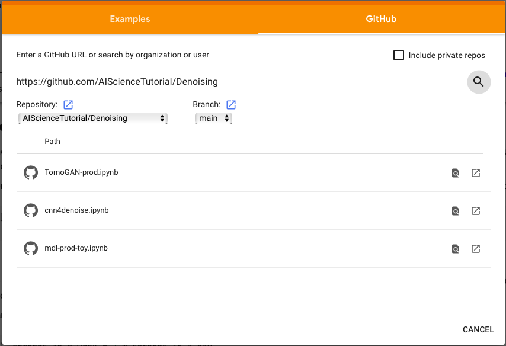

## tutorial on noise and/or artifacts removal using convolution neural network

The tutorial is currently composed of three notebooks: 

  - `cnn4denoise.ipynb` how to build and train a basic convolution neural networks to denoise a synthesized dataset
  - `mdl-prod-toy.ipynb` Assmue you train the model on a cluster or desktop that has an NVIDIA GPU and save your model to a file. THis notebook explains how to load the trained model and run it on your laptop to denoise your images.
  - `TomoGAN-prod.ipynb` explains how to train the more advanced TomoGAN for real scientific images, and use it in real world.
  
## Using the Notebooks

The notebooks are designed to be easy to use on the cloud or on your own systems.

### Running Locally

The environment needed for the notebook is described in [`environment.yml`](./environment.yml)

First, install [Anaconda](https://docs.anaconda.com/anaconda/install/) then use Anaconda's command line tool to build the environment:

```bash
conda env create --file environment.yml
```

### Running on Google Colab

- go to `https://colab.research.google.com/` then log in your Google account
- Try to go to `File -> Open` if the following box does not show up
- Hit the `GitHub` tab shown in the open box, then past `https://github.com/AIScienceTutorial/Denoising` as shown in the following screenshot and hit the search button
- Choose and hit a notebook that you want to run.
- play it and enjoy(hopefully)

 
